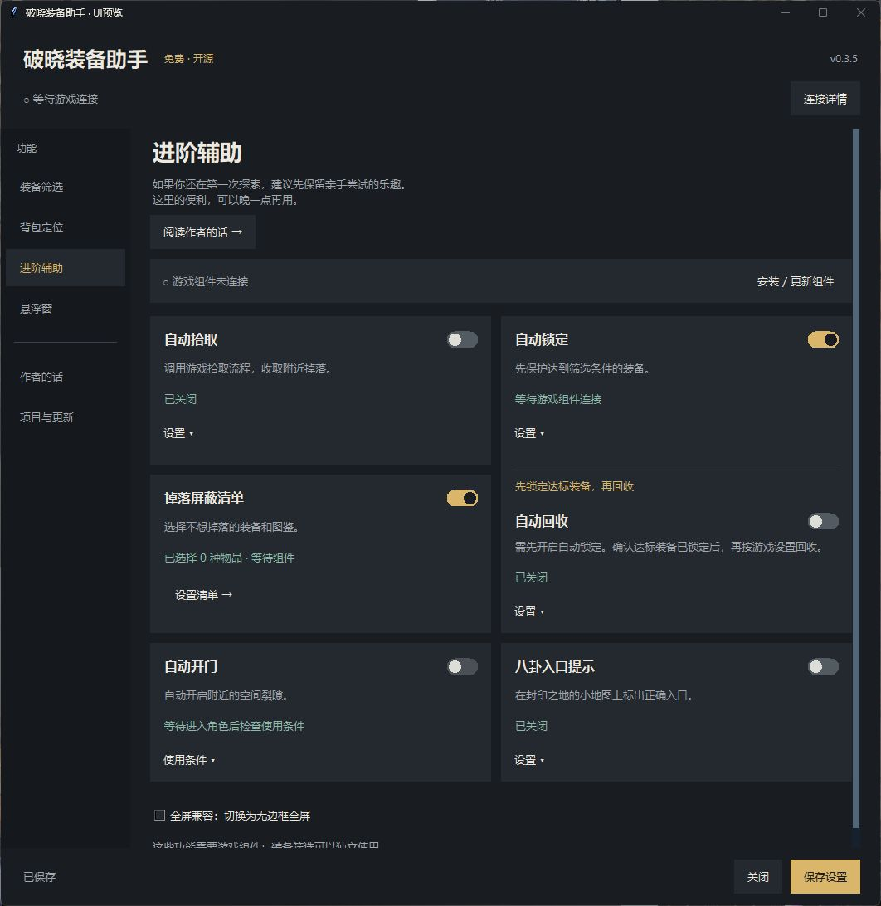
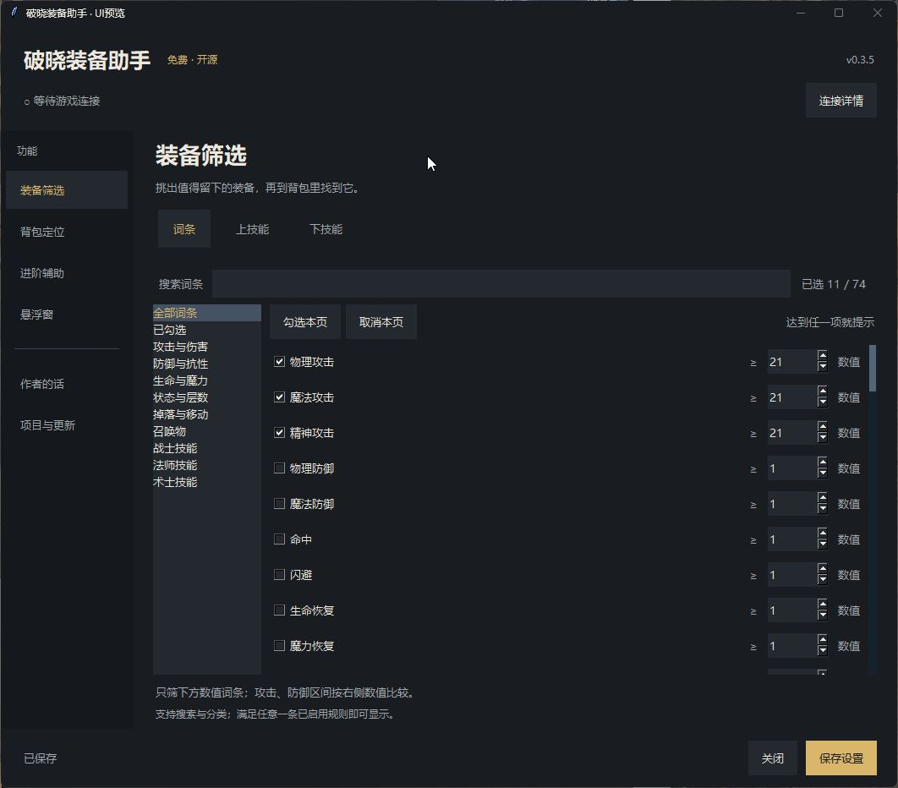

# 破晓装备助手

**完全免费，下载和使用均不收费。**

适用于 Steam 版《破晓之墟》（Ruins of Dawn）的 Windows 助手。筛选装备、定位背包格子，并提供可选的进阶辅助。

## 下载 v0.3.5 预览版

### [蓝奏云下载](https://wwaou.lanzoup.com/b01giaqhvg) · 密码 **71my**

大陆用户优先使用蓝奏云。文件由作者同步，请核对文件名中的版本号。

[GitHub 下载 Windows 完整包](https://github.com/kkray983681062-bit/RuinsLootHelper/releases/download/v0.3.5/RuinsLootHelper-0.3.5-Windows-x64.zip) · [本次版本与校验值](https://github.com/kkray983681062-bit/RuinsLootHelper/releases/tag/v0.3.5)

Windows 10/11 · 64 位 · 约 72 MB。游戏组件随包提供，安装组件无需联网。

0.3.5 暂以预览版发布：界面回归及 EXE 只读背包连接已通过；合并后的新游戏组件仍需重启实测。蓝奏云同步以文件夹内实际版本为准。详情见[验证与限制](docs/validation.md)。

## 开始使用

1. 完整解压 ZIP，保留 `_internal` 文件夹，运行 **破晓装备助手.exe**。
2. 启动游戏并进入角色。助手会记住游戏路径，自动连接当前会话。
3. 在 **装备筛选** 中设置词条、上技能、下技能，点击右下角 **保存设置**。
4. 需要进阶辅助时，再到 **进阶辅助 → 安装 / 更新组件**，安装后重启游戏。

装备筛选可以独立使用。自动锁定与自动回收上下放在同一组，先锁定达标装备，再回收。

## 0.3.5 的变化

- 深色主窗口与侧栏导航，固定保存按钮，显示未保存 / 已保存状态。
- 保留完全透明悬浮窗、背包空位、三栏目显示开关与细分割线拖动。
- **自动开门**：自动开启附近空间裂隙；通过本次使用条件后，切换角色仍可使用。
- **八卦入口提示**：在封印之地的小地图上标出正确入口，离开区域后隐藏。
- 独立的作者页、掉落屏蔽清单与蓝奏云下载入口；不显示拦截次数。

自动开门条件：等级 ≥50，或额外掉落率与额外极品率均 ≥300%。八卦提示在地图放大时隐藏，加入他人房间时可能读不到入口。

## 界面截图

以下为本地程序界面预览；功能开关与数据为演示配置。

[使用说明](docs/getting-started.md) · [常见问题](docs/faq.md) · [更新记录](CHANGELOG.md) · [反馈问题](https://github.com/kkray983681062-bit/RuinsLootHelper/issues/new/choose)

源码与项目说明

本版本的程序、测试和构建文件在 [source](source/) 目录；见[开发说明](docs/development.md)。

[项目与许可说明](NOTICE.md) · [验证与限制](docs/validation.md)

本项目为个人维护的非官方工具，与游戏开发商、发行商及 Steam 无隶属关系。

