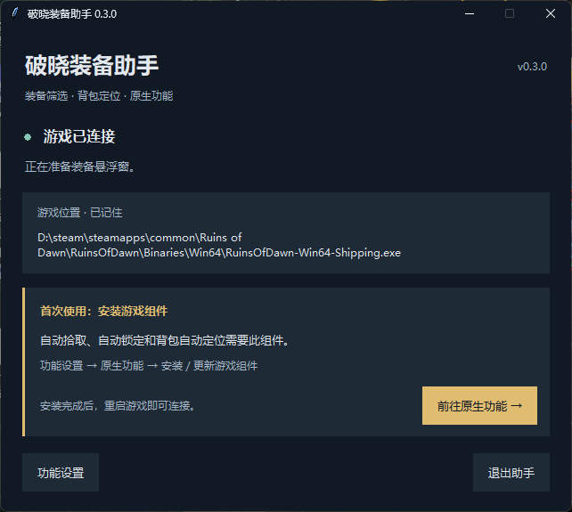
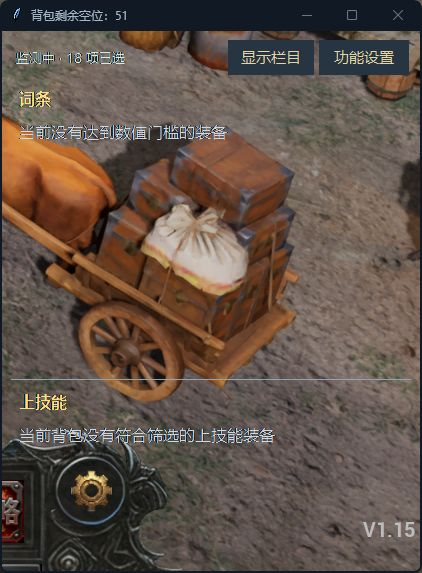

# 破晓装备助手

**装备筛选 · 背包定位 · 原生功能加强**

面向 Steam 版《破晓之墟》（Ruins of Dawn）的 Windows 辅助工具。把达标词条、上技能、下技能分开显示，并提示装备在主背包的第几行、第几格。

[使用说明](docs/getting-started.md) · [常见问题](docs/faq.md) · [更新记录](CHANGELOG.md) · [反馈问题](https://github.com/kkray983681062-bit/RuinsLootHelper/issues/new/choose)

## 下载

| 渠道 | 链接 | 状态 |
| --- | --- | --- |
| GitHub | [版本下载](https://github.com/kkray983681062-bit/RuinsLootHelper/releases) | 发行包待上传 |
| 蓝奏云 | [打开下载文件夹](https://wwaou.lanzoup.com/b01giaqhvg) · 密码 **71my** | 链接已验证，当前文件夹为空 |

**当前先公开源码，尚未在以上入口提供新版 EXE。** 下载源代码可使用页面上的 **Code → Download ZIP**；源码 ZIP 需要 Python 环境，不能直接当作 Windows 程序运行。完整发行包上传后会更新此处。

## 界面截图

| 启动连接页（0.3.0） | 游戏内悬浮窗（当前运行界面） |
| --- | --- |
| [](docs/images/startup.png) | [](docs/images/overlay.jpg) |

点击图片可查看原图。启动页来自提供的 0.3.0 截图；悬浮窗于 2026-09-09 实际运行时截取。

## 功能

- **装备筛选**：属性门槛自行勾选，词条、上技能、下技能独立显示。
- **背包定位**：显示行列位置；打开主背包时用独立穿透层标记目标格子。
- **悬浮面板**：栏目可隐藏，分隔线可拖动，窗口大小和显示设置可保存。
- **路径记忆**：优先使用已保存的游戏安装位置，失效后重新查找 Steam 游戏库。
- **原生功能加强（测试中）**：可选自动拾取、自动锁定、自动回收、自动格子定位及无边框模式。主动安装游戏组件并启用后才执行。
- **拾取排除库**：按名称搜索装备和图鉴，分别勾选；新掉落屏蔽的实际效果仍需当前游戏版本实测。

普通锁定装备和移出主背包的装备从提示中清除。助手自动锁定成功后，词条提示可短暂保留 10 秒。

## 从源码运行

需要 **Windows 10/11 x64、Python 3.11 x64（包含 Tcl/Tk）** 和已安装的 Steam 游戏。桌面运行部分使用 Python 标准库；构建和 Lua 测试另有开发依赖。

```powershell
git clone https://github.com/kkray983681062-bit/RuinsLootHelper.git
cd RuinsLootHelper
py -3.11 -B loot_app.py
```

首次启动按提示确认游戏位置。设置保存在 `%LOCALAPPDATA%\RuinsLootHelper`。如果游戏以管理员权限运行，助手需要相应读取权限。

开发依赖、自动测试与构建命令见 [开发说明](docs/development.md)。

## 当前状态

本仓库是当前功能源码，界面版本仍为 `0.3.0`，不等于此前的 `0.3.0` 二进制包包含全部最新改动。发布包必须与对应版本说明一起使用。

原生适配基于 Steam AppID `4364910`、构建 `24933058`。自动测试主要覆盖本地策略、模拟游戏对象和 Tk 界面；不代表所有原生动作已在当前游戏里验证。真正的独占全屏可能遮住普通悬浮层，可使用窗口或无边框模式。

[验证与限制](docs/validation.md) · [项目与许可说明](NOTICE.md) · [原生组件说明](native/README.md)

本项目为个人维护的非官方工具，与游戏开发商、发行商及 Steam 无隶属关系。
